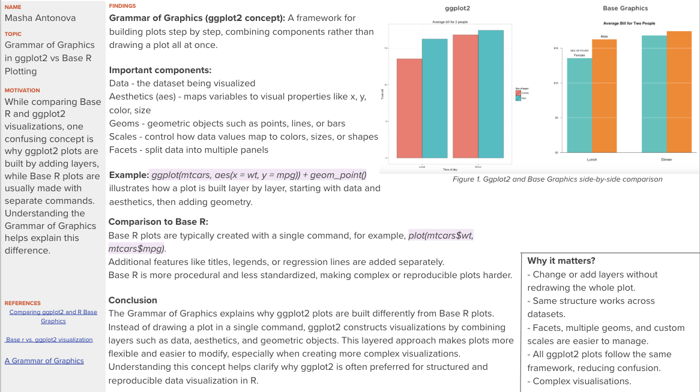

```{r}
#| echo: false

```

## Extra

## TOPIC & MOTIVATION

Topic: What is the Grammar of Graphics in ggplot2 and how is it different from Base R?

The Confusion: Students often wonder why `ggplot2` requires a "plus" sign and multiple functions just to make a simple scatter plot. 

The Solution: Understanding that `ggplot2` isn't just a plotting function—it's a formal grammar for data visualization.

## FINDINGS: The Grammar Components

The Grammar of Graphics (GoG) breaks a plot into independent layers:

Data: The raw variables (the "Noun").
Aesthetics (aes): Mapping data to visual properties like x, y, or color (the "Adjectives").
Geoms: The actual marks (points, bars) on the screen (the "Verbs").
Facets: Splitting one plot into many based on a category.

```{r}
library(ggplot2)

# Let's say we want to see this plot split by 'Day of the Week'
# In ggplot2, we just add ONE component to our existing grammar:

ggplot(mtcars, aes(x = wt, y = mpg, color = factor(cyl))) +
  geom_point() +
  geom_smooth(method = "lm", se = FALSE) + 
  facet_wrap(~am) + 
  labs(title = "Adding Layers without Redrawing")
```

## CONCLUSION

The Grammar of Graphics explains why ggplot2 feels more structured.

Base R is like painting: if you want to change the background, you might have to paint over what you already did.

ggplot2 is like a deck of transparencies: you can swap the "Data" layer or the "Theme" layer without touching the "Geometry" layer.

## EXTRA: THE "POWER OF THE GRAMMAR"

```{r}
library(ggplot2)

# 1. THE "OBJECT" ADVANTAGE
# In Base R, a plot is just pixels on a screen. 
# In ggplot2, a plot is an OBJECT you can save and change later.

p <- ggplot(mpg, aes(x = displ, y = hwy, color = class))

p + geom_point()                 # Version A: Scatter
p + geom_jitter()                # Version B: Jittered (to see overlaps)
p + geom_count()                 # Version C: Bubble chart


# 2. THE "STATISTICAL" LAYER 
# The Grammar includes "Stats." You don't have to calculate means or 
# regression lines yourself; you just add the layer.

p + 
  geom_point(alpha = 0.5) +          # Add points with transparency
  geom_smooth(method = "lm") +       # Add a linear model layer
  facet_wrap(~drv)                   # Split by drive type (4wd, fwd, rwd)


# 3. THE "THEME" LAYER (The Non-Data Ink) 
# Because the "Look" is a separate layer from the "Data," 
# you can change the entire aesthetic in one line.

final_plot <- p + geom_point() + geom_smooth()

final_plot + theme_bw()              # Clean and professional
final_plot + theme_dark()            # High contrast
final_plot + theme_void()            # Only the data, no axes!


# 4. BASE R COMPARISON (The "Hard Way") 
# To do the "Faceting" from step 2 in Base R, you'd need something like this:

par(mfrow = c(1, 3)) 
with(mpg[mpg$drv == "4", ], plot(displ, hwy, main="4wd"))
with(mpg[mpg$drv == "f", ], plot(displ, hwy, main="fwd"))
with(mpg[mpg$drv == "r", ], plot(displ, hwy, main="rwd"))
```


