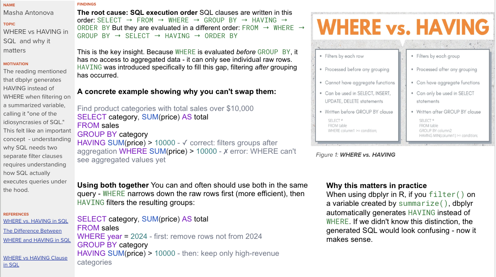

```{r}
#| echo: false

```

## Extra 

```{r}
library(tidyverse)
library(dbplyr)
library(DBI)
library(RSQLite)

# Create an in-memory SQLite database to demonstrate WHERE vs HAVING
con <- dbConnect(SQLite(), ":memory:")

# Create sample sales data
sales <- tibble(
  category = c("Electronics", "Electronics", "Clothing", "Clothing", 
                "Food", "Food", "Food", "Books"),
  year = c(2024, 2023, 2024, 2024, 2024, 2024, 2023, 2024),
  price = c(5000, 6000, 3000, 4000, 1000, 2000, 500, 800)
)

dbWriteTable(con, "sales", sales)

# PART 1: Show SQL execution order in action 

# WHERE filters rows BEFORE grouping
tbl(con, "sales") |>
  filter(year == 2024) |>          
  group_by(category) |>
  summarise(total = sum(price)) |>
  show_query()                   

# HAVING filters AFTER grouping
tbl(con, "sales") |>
  group_by(category) |>
  summarise(total = sum(price)) |>
  filter(total > 3000) |>        
  show_query()                   

# PART 2: Using both WHERE + HAVING together

tbl(con, "sales") |>
  filter(year == 2024) |>         
  group_by(category) |>
  summarise(total = sum(price)) |>
  filter(total > 3000) |>          
  show_query()

# PART 3: Prove WHERE cannot see aggregated values

# This would FAIL in raw SQL (WHERE SUM(price) > 3000)
# dbplyr protects us by automatically using HAVING instead
result <- tbl(con, "sales") |>
  group_by(category) |>
  summarise(total = sum(price)) |>
  filter(total > 3000) |>
  collect()                        

print(result)

# PART 4: Compare results with and without the year filter

# Without WHERE (all years grouped)
all_years <- tbl(con, "sales") |>
  group_by(category) |>
  summarise(total = sum(price)) |>
  collect()

# With WHERE (only 2024 rows)
only_2024 <- tbl(con, "sales") |>
  filter(year == 2024) |>
  group_by(category) |>
  summarise(total = sum(price)) |>
  collect()

# Side-by-side comparison
all_years |> rename(total_all_years = total) |>
  left_join(only_2024 |> rename(total_2024 = total), by = "category")

dbDisconnect(con)
```

